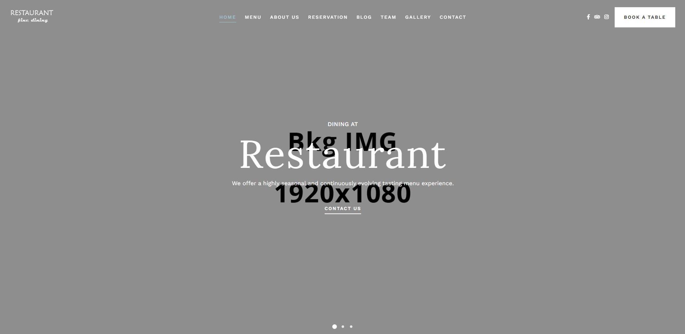
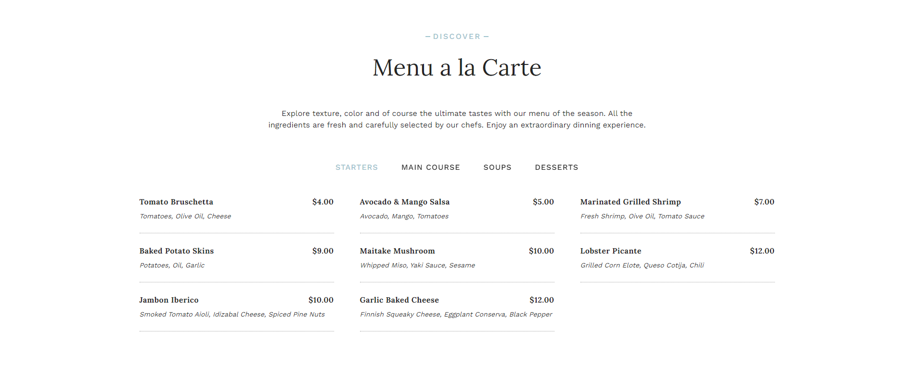
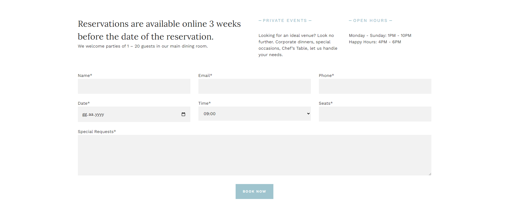
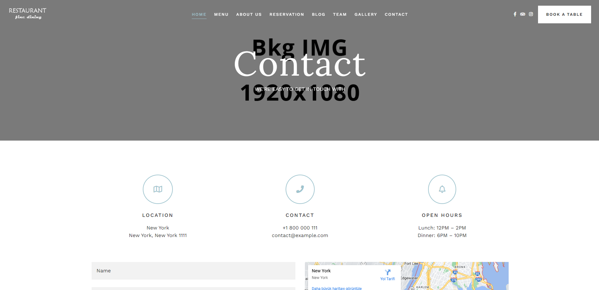

<div align="center">
  
</div>

##  About The Project

This template is a clean and simple restaurant HTML template suitable for bar, cafe, pizza, bistro, food, dining service businesses. It includes all the features for a restaurant website ( menu Pages, team Pages, gallery pages, contact and reservation pages ) . It’s fully responsive and looks great on all mobile devices.

```html
<!-- HTML Meta Tags -->
<meta charset="UTF-8">
<meta name="viewport" content="width=device-width, initial-scale=1, maximum-scale=1">
<meta name="author" content="Sinan Özçelik">
<meta name="publisher" content="VS 2023">
<!-- Web Site Title -->
<title>Responsive Restaurant Web Template</title>
<!-- Meta Open Graph -->
<meta property="og:locale" content="en_US" />
<meta property="og:type" content="website" />
<meta property="og:title" content="Homepage" />
<meta property="og:url" content="Responsive Restaurant Web Template" />
<meta property="og:site_name" content="Responsive Restaurant Web Template" />
```

##  Features

- [x] 100% Responsive and Mobile-Friendly
- [x] Home Slider
- [x] Food Menu Pages
- [x] Team Members Pages
- [x] About Us Pages
- [x] Gallery Pages
- [x] Blog Pages
- [x] Sticky Header
- [x] Working Ajax Contact Form
- [x] Valid HTML5 and CSS3
- [x] SEO Optimized
- [x] Excellent Customer Support
- [x] Social Media Icons
- [x] Google Fonts
- [x] Cross browser Compatible

##  Build With


## 💻 Project View







